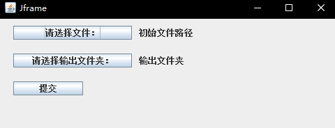

# JavaAutoTranslate
JAVA 自动调用谷歌翻译接口实现读取txt文档进行翻译（英译汉）  
使用的是该作者封装成的谷歌api，[链接](https://github.com/lsj9383/translate-set) 感谢该作者的分享！

### 1. 程序介绍
主要用在翻译论文pdf文件，通常这种文件都是不连续的，在翻译时候需要进行删除换行连成句子，本程序通过按行读取txt文档中的文字，连接成句，之后调用谷歌翻译的api进行翻译，将翻译的结果保存在txt文档，生成的文档会自动的生成，需要在翻译的时候指定文件夹。

### 2.使用说明：
使用java 可视化界面程序运行界面如下：  
  

### 3.使用方法：
1、 新建txt文档保存需要翻译的英文。  
2、 点击“请选择文件”，选中新建的txt文档。  
3、 点击“请选择输出文件夹”，在窗口中选中一个文件夹，翻译的结果会保存在改文件夹中。  
4、 将需要翻译的文件复制到txt文件中去，进行保存，点击提交即可记性翻译。  
ps:一次不能够翻译太多的文件，否则会进行报错，谷歌一次翻译的长度有限制。翻译的结果是追加到文件中，不会进行覆盖！  

